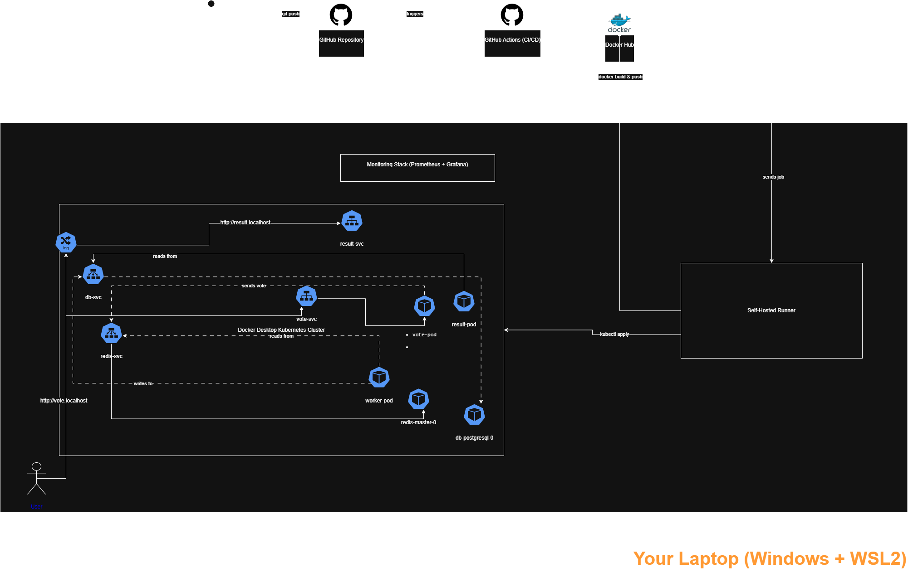

# Voting Application - DevOps Challenge

## Project Overview

This repository contains a complete and comprehensive solution for the "Hiring Quest" requirements. The **Distributed Voting App** has been transformed from just source code into a **fully automated, production-ready, secure, and observable environment**.

The goal was not just to "run" the application, but to build a resilient infrastructure using modern **GitOps** and **DevSecOps** principles.

---

## 🏛️ Solution Architecture

The infrastructure is designed to be scalable and secure. Instead of using AKS (due to subscription limitations), **Docker Desktop Kubernetes** was used as a full-featured local alternative, demonstrating that the architecture is **portable** to any Kubernetes cluster.




### 🛠️ Tech Stack Used

| Category | Technology | Purpose |
| :--- | :--- | :--- |
| **Containerization** | `Docker` / `Docker Compose` | Build application images and run locally. |
| **Orchestration** | `Kubernetes (Docker Desktop)` | Manage, scale, and run containers in a production-like environment. |
| **Infrastructure as Code (IaC)** | `Kubernetes YAML` / `Helm` | Define and deploy applications (Deployments, Services, Ingress) and databases. |
| **Automation (CI/CD)** | `GitHub Actions` | Fully automate build, test, deployment, and updates. |
| **Security (DevSecOps)** | `Trivy` / `NetworkPolicies` | Scan images for vulnerabilities (CVEs) and isolate networks within the cluster. |
| **Observability** | `Prometheus` / `Grafana` | Collect metrics and display live dashboards for system performance. |
| **Runner** | `Self-Hosted Runner` | Execute the pipeline locally to interact with the local cluster. |

---

## 🚦 How to Run

There are two ways to run this solution:

### 1. Quick Local Run (Docker Compose)

Ideal for development and quick testing.

1. Ensure `Docker Desktop` is installed.
2. In the terminal, start the application:
    ```bash
    docker compose up --build
    ```
3. To add sample data (3000 votes), open a new terminal and run:
    ```bash
    docker compose --profile seed up
    ```
4. Access the applications:
    * **Vote:** `http://localhost:8080`
    * **Result:** `http://localhost:8081`

### 2. Kubernetes Run (Production Simulation)

This is the full environment including observability and security.

#### Prerequisites
1. `Docker Desktop` (with Kubernetes enabled in settings).
2. `kubectl` (Kubernetes CLI).
3. `Helm` (Kubernetes package manager).
4. Modify the `hosts` file (for `vote.localhost`).

#### Steps
1. **Install Ingress Controller:**
    ```bash
    kubectl apply -f [https://raw.githubusercontent.com/kubernetes/ingress-nginx/main/deploy/static/provider/kind/deploy.yaml](https://raw.githubusercontent.com/kubernetes/ingress-nginx/main/deploy/static/provider/kind/deploy.yaml)
    ```
    (Wait a minute until `ingress-nginx-controller` shows `Running`.)

2. **Install Databases (Helm):**
    ```bash
    # Add repos
    helm repo add bitnami [https://charts.bitnami.com/bitnami](https://charts.bitnami.com/bitnami)
    helm repo update

    # Install PostgreSQL
    helm install db bitnami/postgresql \
      --set global.postgresql.auth.postgresPassword=postgres \
      --set global.postgresql.auth.username=postgres \
      --set global.postgresql.auth.database=postgres \
      --set persistence.enabled=false

    # Install Redis
    helm install redis bitnami/redis \
      --set auth.enabled=false \
      --set persistence.enabled=false
    ```

3. **Modify `hosts` file (mandatory):**
    * Open `hosts` file as admin: `C:\Windows\System32\drivers\etc\hosts`
    * Add these lines at the end and save:
    ```
    127.0.0.1  vote.localhost
    127.0.0.1  result.localhost
    ```

4. **Deploy the Application:**
    * Apply all `k8s` files (Deployment, Service, Ingress, NetworkPolicy):
    ```bash
    kubectl apply -f k8s/
    ```

5. **Access the applications:**
    * **Vote App:** `http://vote.localhost`
    * **Result App:** `http://result.localhost`

---

## 🔄 CI/CD Pipeline

A full CI/CD pipeline was built using **GitHub Actions**, focusing on **DevSecOps** principles.

#### 1. Runner
Since the cluster is running locally (`docker-desktop`), the pipeline uses a **Self-Hosted Runner**, which is the only entity able to interact with the cluster to perform deployment commands.

#### 2. Pipeline Steps (`.github/workflows/ci-cd.yaml`)

The pipeline runs automatically on any `push` to the `main` branch:

1. **Checkout:** Pull the latest code.
2. **Login:** Log into Docker Hub using **Secrets**.
3. **Build:** Build Docker images for `vote`, `result`, `worker` locally.
4. **Scan (Trivy):** **(DevSecOps step)** Scan all images for critical/high CVEs. The pipeline is currently set to `exit-code 0` (Warn only) to allow deployment for this demo, but the logs will still show all found vulnerabilities. For a true production environment, this would be set to `exit-code 1` (Fail).
5. **Push:** Push only secure images to Docker Hub.
6. **Deploy:** Apply updated `k8s/` manifests to the cluster.
7. **Rollout:** Force Deployments to restart to pull new images immediately.

---

## 🔒 Security & Observability

### Security
1. **Vulnerability Scanning (Trivy):** Integrated into the pipeline to prevent deploying images with known CVEs.
2. **Network Isolation (NetworkPolicies):** Applied `k8s/network-policy.yaml` to create an internal firewall allowing only `result` and `worker` to access the `db-postgresql-0`.
3. **Non-Root Containers (PSA compliant):** All `Dockerfile`s create a non-root `app` user to comply with basic Pod Security Admission (PSA) requirements.

### Observability
1. **Installation:** Installed `kube-prometheus-stack` (via Helm), which includes Prometheus and Grafana.
2. **Grafana Access:**
    * **Step 1 (Terminal):** Run port-forward: `kubectl port-forward svc/monitoring-grafana 3000:80`
    * **Step 2 (Terminal):** Get password: `kubectl get secret monitoring-grafana -o jsonpath="{.data.admin-password}" | base64 -d ; echo`
    * **Step 3 (Browser):** Open `http://localhost:3000` (user: `admin`, password from Step 2)
    * Dashboards available include `Kubernetes / Compute Resources / Cluster`.

---

## 🤯 Real Troubleshooting Challenges Solved

During this solution, several real-world (Day-2) problems were encountered and resolved:

1. **Issue: `GLIBC_2.34 not found` (vote container crash)**
    * **Analysis:** `python:3.10-slim-buster` image was outdated and missing essential libraries.
    * **Solution:** Upgrade to `python:3.10-bullseye` (full version) to resolve dependencies.

2. **Issue: `Connection Refused` (result container cannot connect to DB)**
    * **Analysis:** `result/server.js` was hard-coded to look for DB named `postgres` with user `postgres` at host `db`.
    * **Solution:** Modify `helm install postgresql` to create DB and user with these names and create an `ExternalName` service pointing `db` to `db-postgresql.default.svc.cluster.local`.

3. **Issue: `CrashLoopBackOff` in `prometheus-node-exporter`**
    * **Analysis:** Node exporter tries to access host files not allowed by Docker Desktop VM.
    * **Solution:** Disable this part using `helm upgrade ... --set prometheus-node-exporter.enabled=false`.

4. **Issue: `no such file or directory` (seed-data failed)**
    * **Analysis:** `generate-votes.sh` was created on Windows, introducing `\r\n` line endings not recognized by Linux.
    * **Solution:** Add `dos2unix` to `seed-data/Dockerfile` to clean the script before execution.

---

## ☁️ Trade-offs & Azure Alternative

### Trade-offs
Due to Azure subscription limitations, the solution uses **Docker Desktop Kubernetes** instead of AKS. Terraform for creating AKS was not implemented.

### Azure Experience (AZ-104 / AZ-400) & Migration Path
As an experienced Azure professional (AZ-104 and AZ-400 certified), migrating this project to AKS would be straightforward:

1. **Infrastructure (Terraform):**
    * Write Terraform code to create `azurerm_resource_group`, `azurerm_virtual_network`, `azurerm_subnet` (with NSGs), and `azurerm_kubernetes_cluster` (AKS).

2. **Databases (Managed Services):**
    * Instead of running databases as pods inside the cluster, use Azure managed services.
    * Create **Azure Database for PostgreSQL** and **Azure Cache for Redis** via Terraform.
    * Pass connection strings as `Secrets` to deployments (`vote`, `result`, `worker`).

3. **CI/CD Pipeline Changes:**
    * Change `runs-on: self-hosted` to `runs-on: ubuntu-latest` for GitHub cloud runners.
    * Add `az login` step using a Service Principal stored in GitHub Secrets.
    * Add `az aks get-credentials` step to connect `kubectl` to the new cluster.

4. **Ingress:**
    * Install NGINX Ingress on AKS, or preferably use **Azure Application Gateway Ingress Controller (AGIC)** for direct integration with Azure services.
